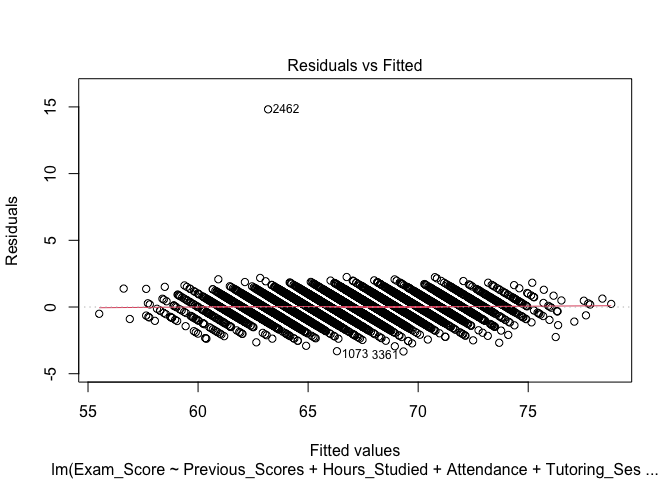
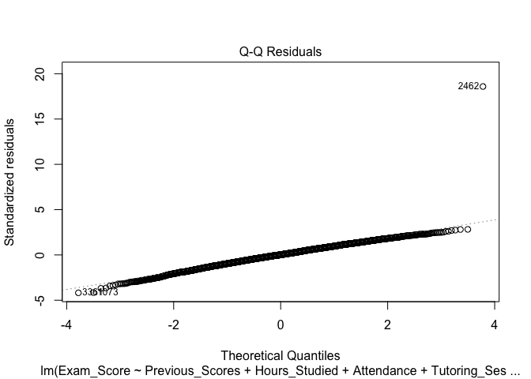
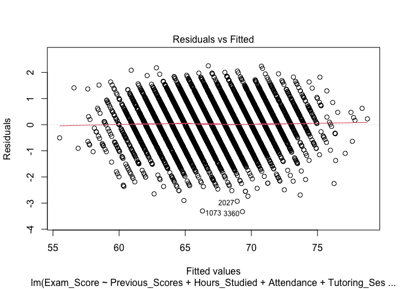
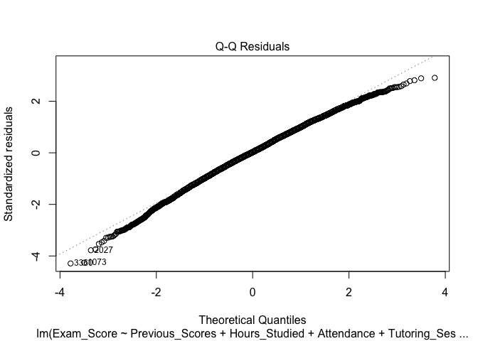

STAT_308_Project_Code
================
Justin Peabody
2026-04-12

# Introduction and Data Preparation

This is a file containing the R code I used to run the regression
analyses and generate relevant visualizations for my STAT 308 final
project. I used alpha=0.05 as the significance level for F tests of
overall model significance and partial F tests. I used alpha=0.01 as the
significance level for hypothesis tests of Jackknife residuals.

``` r
#To begin, I called the relevant packages and loaded the Kaggle data. 

library(tidyverse)
```

    ## Warning: package 'ggplot2' was built under R version 4.4.3

    ## Warning: package 'tibble' was built under R version 4.4.3

    ## Warning: package 'tidyr' was built under R version 4.4.3

    ## Warning: package 'readr' was built under R version 4.4.3

    ## Warning: package 'purrr' was built under R version 4.4.3

    ## Warning: package 'dplyr' was built under R version 4.4.3

    ## ── Attaching core tidyverse packages ──────────────────────── tidyverse 2.0.0 ──
    ## ✔ dplyr     1.2.0     ✔ readr     2.1.6
    ## ✔ forcats   1.0.1     ✔ stringr   1.6.0
    ## ✔ ggplot2   4.0.2     ✔ tibble    3.3.1
    ## ✔ lubridate 1.9.4     ✔ tidyr     1.3.2
    ## ✔ purrr     1.2.1     
    ## ── Conflicts ────────────────────────────────────────── tidyverse_conflicts() ──
    ## ✖ dplyr::filter() masks stats::filter()
    ## ✖ dplyr::lag()    masks stats::lag()
    ## ℹ Use the conflicted package (<http://conflicted.r-lib.org/>) to force all conflicts to become errors

``` r
library(regclass)
```

    ## Loading required package: bestglm
    ## Loading required package: leaps
    ## Loading required package: VGAM

    ## Warning: package 'VGAM' was built under R version 4.4.3

    ## Loading required package: stats4
    ## Loading required package: splines
    ## Loading required package: rpart
    ## Loading required package: randomForest
    ## randomForest 4.7-1.2
    ## Type rfNews() to see new features/changes/bug fixes.
    ## 
    ## Attaching package: 'randomForest'
    ## 
    ## The following object is masked from 'package:dplyr':
    ## 
    ##     combine
    ## 
    ## The following object is masked from 'package:ggplot2':
    ## 
    ##     margin
    ## 
    ## Important regclass change from 1.3:
    ## All functions that had a . in the name now have an _
    ## all.correlations -> all_correlations, cor.demo -> cor_demo, etc.

``` r
Education_data<-read_csv("~/Desktop/STAT 308/Data/StudentPerformanceFactors.csv")
```

    ## Rows: 6607 Columns: 20
    ## ── Column specification ────────────────────────────────────────────────────────
    ## Delimiter: ","
    ## chr (13): Parental_Involvement, Access_to_Resources, Extracurricular_Activit...
    ## dbl  (7): Hours_Studied, Attendance, Sleep_Hours, Previous_Scores, Tutoring_...
    ## 
    ## ℹ Use `spec()` to retrieve the full column specification for this data.
    ## ℹ Specify the column types or set `show_col_types = FALSE` to quiet this message.

``` r
#I then generated scatterplots of exam scores (the response variable) against each of the 10 predictor variables my group was interested in. Here is one example:

plot(Exam_Score~Hours_Studied, data=Education_data, col=ifelse(Education_data$Exam_Score>=80, "red", "blue"), pch=19)
```

<!-- -->

Creating these plots made it visually clear that the vast majority of
the dataset represents exam scores below 80. Only a small cluster of
observations correspond to exam scores at or above 80. This motivated
our group to split the data into two datasets based on exam score, then
generate a separate multiple regression model for each dataset.

``` r
High_exam_scores<-Education_data%>%
filter(Exam_Score >= 80)

Lower_exam_scores<-Education_data%>%
filter(Exam_Score<=79)
```

# Lower exam scores model building and assessment

Now that our dataset is split into two subsets, we begin model building,
starting with the lower exam scores dataset.

``` r
#Filtering NA values from lower exam scores data

Lower_exam_scores<-Lower_exam_scores%>%
filter(Parental_Education_Level != "NA")%>%
filter(Distance_from_Home != "NA")

#Generating an initial model with all 10 predictors of interest for lower exam scores

Lower_exam_scores_initial_model<-lm(Exam_Score~Previous_Scores+Hours_Studied+Attendance+Tutoring_Sessions+Access_to_Resources+Parental_Involvement+Peer_Influence+Parental_Education_Level+Family_Income+Distance_from_Home, data=Lower_exam_scores)
summary(Lower_exam_scores_initial_model)
```

    ## 
    ## Call:
    ## lm(formula = Exam_Score ~ Previous_Scores + Hours_Studied + Attendance + 
    ##     Tutoring_Sessions + Access_to_Resources + Parental_Involvement + 
    ##     Peer_Influence + Parental_Education_Level + Family_Income + 
    ##     Distance_from_Home, data = Lower_exam_scores)
    ## 
    ## Residuals:
    ##     Min      1Q  Median      3Q     Max 
    ## -3.3281 -0.4959  0.0131  0.5363 15.6420 
    ## 
    ## Coefficients:
    ##                                        Estimate Std. Error t value Pr(>|t|)    
    ## (Intercept)                          41.9205001  0.1090806  384.31   <2e-16 ***
    ## Previous_Scores                       0.0492300  0.0007157   68.79   <2e-16 ***
    ## Hours_Studied                         0.2979648  0.0017166  173.58   <2e-16 ***
    ## Attendance                            0.1990955  0.0008902  223.65   <2e-16 ***
    ## Tutoring_Sessions                     0.4977756  0.0083279   59.77   <2e-16 ***
    ## Access_to_ResourcesLow               -1.9794069  0.0297494  -66.54   <2e-16 ***
    ## Access_to_ResourcesMedium            -0.9546914  0.0237606  -40.18   <2e-16 ***
    ## Parental_InvolvementLow              -1.9640718  0.0298633  -65.77   <2e-16 ***
    ## Parental_InvolvementMedium           -0.9679577  0.0239547  -40.41   <2e-16 ***
    ## Peer_InfluenceNeutral                 0.4694634  0.0278666   16.85   <2e-16 ***
    ## Peer_InfluencePositive                0.9841139  0.0277512   35.46   <2e-16 ***
    ## Parental_Education_LevelHigh School  -0.4900057  0.0236837  -20.69   <2e-16 ***
    ## Parental_Education_LevelPostgraduate  0.4953776  0.0295513   16.76   <2e-16 ***
    ## Family_IncomeLow                     -0.9518815  0.0284646  -33.44   <2e-16 ***
    ## Family_IncomeMedium                  -0.4113542  0.0284883  -14.44   <2e-16 ***
    ## Distance_from_HomeModerate            0.4821762  0.0373571   12.91   <2e-16 ***
    ## Distance_from_HomeNear                0.9585739  0.0350366   27.36   <2e-16 ***
    ## ---
    ## Signif. codes:  0 '***' 0.001 '**' 0.01 '*' 0.05 '.' 0.1 ' ' 1
    ## 
    ## Residual standard error: 0.8215 on 6385 degrees of freedom
    ## Multiple R-squared:  0.9402, Adjusted R-squared:  0.9401 
    ## F-statistic:  6275 on 16 and 6385 DF,  p-value: < 2.2e-16

This initial model explains 94.02% of the total variation in exam scores
less than 80, based on the multiple r squared. However, we must check
model assumptions via a residual plot and qqplot to assess its
appropriateness.

``` r
plot(Lower_exam_scores_initial_model, 1)
```

<!-- -->

``` r
plot(Lower_exam_scores_initial_model, 2)
```

<!-- -->
Overall, the assumptions of homoskedasticity and residual normality
appear to be satisfied for this model. However, two observations (the
2462nd and 4961st rows of the lower scores data) visually stand out as
possible influential observations.

To statistically test this, we computed the Jackknife residuals and
corresponding p values for these observations and compared the p values
to a significance level of 0.01.

``` r
#H0: observation is not statistically influential
#HA: observation is statistically influential

Lower_scores_Jackknife_residuals<-rstudent((Lower_exam_scores_initial_model))
jk_res_2462<-Lower_scores_Jackknife_residuals[2462]
jk_res_4961<-Lower_scores_Jackknife_residuals[4961]

#p values for each Jackknife residual

n=nrow(Lower_exam_scores)
k=17 #The total number of parameters in our initial model, including all predictors and the intercept

p_value_2462=2*pt(abs(jk_res_2462),df=n-k-1, lower.tail=FALSE)
p_value_2462
```

    ##         2462 
    ## 1.114129e-74

``` r
p_value_4961=2*pt(abs(jk_res_4961),df=n-k-1, lower.tail=FALSE)
p_value_4961
```

    ##         4961 
    ## 1.796819e-83

Both p values are less than 0.01, so for both observations, we reject H0
and conclude that they are statistically influential.

Now, we remove each the influential observations one at a time, starting
with the observation having the highest absolute Jackknife residual
value.

``` r
abs(jk_res_2462)
```

    ##     2462 
    ## 18.52652

``` r
abs(jk_res_4961)
```

    ##    4961 
    ## 19.6448

``` r
#Observation 4961has the higher absolute Jackknife residual of the two, so we remove this observation first and regenerate our model after removal.

Lower_exam_scores_2<-Lower_exam_scores[-4961, ] #Generating a new dataframe excluding row 4961 of Lower_exam_scores

Lower_exam_scores_initial_model_v2<-lm(Exam_Score~Previous_Scores+Hours_Studied+Attendance+Tutoring_Sessions+Access_to_Resources+Parental_Involvement+Peer_Influence+Parental_Education_Level+Family_Income+Distance_from_Home, data=Lower_exam_scores_2)

plot(Lower_exam_scores_initial_model_v2, 1)
```

<!-- -->

``` r
plot(Lower_exam_scores_initial_model_v2, 2)
```

<!-- -->
Observation 2462 still appears influential. We used a Jackknife residual
to statistically test this.

``` r
n2=nrow(Lower_exam_scores_2)

Lower_scores_Jackknife_residuals_2<-rstudent((Lower_exam_scores_initial_model_v2))
jk_res_2462<-Lower_scores_Jackknife_residuals_2[2462]
p_value_2462_2<-2*pt(abs(jk_res_2462), df=n2-k-1, lower.tail=FALSE)
p_value_2462_2
```

    ##         2462 
    ## 3.046222e-79

The p value for this Jackknife residual is still less than 0.01, so we
remove this observation and regenerate the initial model again.

``` r
Lower_exam_scores_3<-Lower_exam_scores_2[-2462, ]
n3=nrow(Lower_exam_scores_3)

Lower_exam_scores_initial_model_v3<-lm(Exam_Score~Previous_Scores+Hours_Studied+Attendance+Tutoring_Sessions+Access_to_Resources+Parental_Involvement+Peer_Influence+Parental_Education_Level+Family_Income+Distance_from_Home, data=Lower_exam_scores_3)

summary(Lower_exam_scores_initial_model_v3)
```

    ## 
    ## Call:
    ## lm(formula = Exam_Score ~ Previous_Scores + Hours_Studied + Attendance + 
    ##     Tutoring_Sessions + Access_to_Resources + Parental_Involvement + 
    ##     Peer_Influence + Parental_Education_Level + Family_Income + 
    ##     Distance_from_Home, data = Lower_exam_scores_3)
    ## 
    ## Residuals:
    ##     Min      1Q  Median      3Q     Max 
    ## -3.3265 -0.4924  0.0188  0.5409  2.2531 
    ## 
    ## Coefficients:
    ##                                        Estimate Std. Error t value Pr(>|t|)    
    ## (Intercept)                          41.8555948  0.1030764  406.06   <2e-16 ***
    ## Previous_Scores                       0.0494138  0.0006761   73.08   <2e-16 ***
    ## Hours_Studied                         0.2983144  0.0016215  183.97   <2e-16 ***
    ## Attendance                            0.1992395  0.0008409  236.92   <2e-16 ***
    ## Tutoring_Sessions                     0.5023849  0.0078681   63.85   <2e-16 ***
    ## Access_to_ResourcesLow               -1.9793063  0.0281005  -70.44   <2e-16 ***
    ## Access_to_ResourcesMedium            -0.9646857  0.0224465  -42.98   <2e-16 ***
    ## Parental_InvolvementLow              -1.9637841  0.0282082  -69.62   <2e-16 ***
    ## Parental_InvolvementMedium           -0.9766941  0.0226292  -43.16   <2e-16 ***
    ## Peer_InfluenceNeutral                 0.4758034  0.0263307   18.07   <2e-16 ***
    ## Peer_InfluencePositive                0.9966858  0.0262203   38.01   <2e-16 ***
    ## Parental_Education_LevelHigh School  -0.5000631  0.0223739  -22.35   <2e-16 ***
    ## Parental_Education_LevelPostgraduate  0.4949072  0.0279134   17.73   <2e-16 ***
    ## Family_IncomeLow                     -0.9391867  0.0268945  -34.92   <2e-16 ***
    ## Family_IncomeMedium                  -0.4043118  0.0269187  -15.02   <2e-16 ***
    ## Distance_from_HomeModerate            0.4991354  0.0353106   14.14   <2e-16 ***
    ## Distance_from_HomeNear                0.9833989  0.0331175   29.69   <2e-16 ***
    ## ---
    ## Signif. codes:  0 '***' 0.001 '**' 0.01 '*' 0.05 '.' 0.1 ' ' 1
    ## 
    ## Residual standard error: 0.776 on 6383 degrees of freedom
    ## Multiple R-squared:  0.9465, Adjusted R-squared:  0.9463 
    ## F-statistic:  7054 on 16 and 6383 DF,  p-value: < 2.2e-16

``` r
plot(Lower_exam_scores_initial_model_v3, 1)
```

<!-- -->

``` r
plot(Lower_exam_scores_initial_model_v3, 2)
```

<!-- --> The
assumptions of homoskedasticity and residual normality still appear
satisfied. Since no apparent influential observations remain, we use
Lower_exam_scores_initial_model_v3 as our starting point for variable
selection.

# Lower exam scores variable selection

Our variable selection process begins with performing partial F tests
for the significance of removing each predictor from the model while
keeping all the others.

``` r
#Previous scores
test_model_1<-lm(Exam_Score~Hours_Studied+Attendance+Tutoring_Sessions+Access_to_Resources+Parental_Involvement+Peer_Influence+Parental_Education_Level+Family_Income+Distance_from_Home, data=Lower_exam_scores_3)
anova(test_model_1, Lower_exam_scores_initial_model_v3)
```

    ## Analysis of Variance Table
    ## 
    ## Model 1: Exam_Score ~ Hours_Studied + Attendance + Tutoring_Sessions + 
    ##     Access_to_Resources + Parental_Involvement + Peer_Influence + 
    ##     Parental_Education_Level + Family_Income + Distance_from_Home
    ## Model 2: Exam_Score ~ Previous_Scores + Hours_Studied + Attendance + Tutoring_Sessions + 
    ##     Access_to_Resources + Parental_Involvement + Peer_Influence + 
    ##     Parental_Education_Level + Family_Income + Distance_from_Home
    ##   Res.Df    RSS Df Sum of Sq      F    Pr(>F)    
    ## 1   6384 7059.7                                  
    ## 2   6383 3843.4  1    3216.3 5341.5 < 2.2e-16 ***
    ## ---
    ## Signif. codes:  0 '***' 0.001 '**' 0.01 '*' 0.05 '.' 0.1 ' ' 1

``` r
#The full model with previous scores and all other predictors provides a significantly better model fit for lower exam scores than the model without previous scores (p<2.2e^16); therefore, we keep it in the model for now.

#Hours studied
test_model_2<-lm(Exam_Score~Previous_Scores+Attendance+Tutoring_Sessions+Access_to_Resources+Parental_Involvement+Peer_Influence+Parental_Education_Level+Family_Income+Distance_from_Home, data=Lower_exam_scores_3)
anova(test_model_2, Lower_exam_scores_initial_model_v3)
```

    ## Analysis of Variance Table
    ## 
    ## Model 1: Exam_Score ~ Previous_Scores + Attendance + Tutoring_Sessions + 
    ##     Access_to_Resources + Parental_Involvement + Peer_Influence + 
    ##     Parental_Education_Level + Family_Income + Distance_from_Home
    ## Model 2: Exam_Score ~ Previous_Scores + Hours_Studied + Attendance + Tutoring_Sessions + 
    ##     Access_to_Resources + Parental_Involvement + Peer_Influence + 
    ##     Parental_Education_Level + Family_Income + Distance_from_Home
    ##   Res.Df     RSS Df Sum of Sq     F    Pr(>F)    
    ## 1   6384 24223.0                                 
    ## 2   6383  3843.4  1     20380 33846 < 2.2e-16 ***
    ## ---
    ## Signif. codes:  0 '***' 0.001 '**' 0.01 '*' 0.05 '.' 0.1 ' ' 1

``` r
#Significant (p<2.2e^-16): keep hours studied in the model for now

#Attendance
test_model_3<-lm(Exam_Score~Previous_Scores+Hours_Studied+Tutoring_Sessions+Access_to_Resources+Parental_Involvement+Peer_Influence+Parental_Education_Level+Family_Income+Distance_from_Home, data=Lower_exam_scores_3)
anova(test_model_3, Lower_exam_scores_initial_model_v3)
```

    ## Analysis of Variance Table
    ## 
    ## Model 1: Exam_Score ~ Previous_Scores + Hours_Studied + Tutoring_Sessions + 
    ##     Access_to_Resources + Parental_Involvement + Peer_Influence + 
    ##     Parental_Education_Level + Family_Income + Distance_from_Home
    ## Model 2: Exam_Score ~ Previous_Scores + Hours_Studied + Attendance + Tutoring_Sessions + 
    ##     Access_to_Resources + Parental_Involvement + Peer_Influence + 
    ##     Parental_Education_Level + Family_Income + Distance_from_Home
    ##   Res.Df   RSS Df Sum of Sq     F    Pr(>F)    
    ## 1   6384 37642                                 
    ## 2   6383  3843  1     33799 56132 < 2.2e-16 ***
    ## ---
    ## Signif. codes:  0 '***' 0.001 '**' 0.01 '*' 0.05 '.' 0.1 ' ' 1

``` r
#Significant (p<2.2e^-16): keep attendance in the model for now

#Tutoring sessions
test_model_4<-lm(Exam_Score~Previous_Scores+Hours_Studied+Attendance+Access_to_Resources+Parental_Involvement+Peer_Influence+Parental_Education_Level+Family_Income+Distance_from_Home, data=Lower_exam_scores_3)
anova(test_model_4, Lower_exam_scores_initial_model_v3)
```

    ## Analysis of Variance Table
    ## 
    ## Model 1: Exam_Score ~ Previous_Scores + Hours_Studied + Attendance + Access_to_Resources + 
    ##     Parental_Involvement + Peer_Influence + Parental_Education_Level + 
    ##     Family_Income + Distance_from_Home
    ## Model 2: Exam_Score ~ Previous_Scores + Hours_Studied + Attendance + Tutoring_Sessions + 
    ##     Access_to_Resources + Parental_Involvement + Peer_Influence + 
    ##     Parental_Education_Level + Family_Income + Distance_from_Home
    ##   Res.Df    RSS Df Sum of Sq      F    Pr(>F)    
    ## 1   6384 6298.3                                  
    ## 2   6383 3843.4  1    2454.8 4076.9 < 2.2e-16 ***
    ## ---
    ## Signif. codes:  0 '***' 0.001 '**' 0.01 '*' 0.05 '.' 0.1 ' ' 1

``` r
#Significant (p<2.2e^-16): keep tutoring sessions in the model for now

#Access to resources
test_model_5<-lm(Exam_Score~Previous_Scores+Hours_Studied+Attendance+Tutoring_Sessions+Parental_Involvement+Peer_Influence+Parental_Education_Level+Family_Income+Distance_from_Home, data=Lower_exam_scores_3)
anova(test_model_5, Lower_exam_scores_initial_model_v3)
```

    ## Analysis of Variance Table
    ## 
    ## Model 1: Exam_Score ~ Previous_Scores + Hours_Studied + Attendance + Tutoring_Sessions + 
    ##     Parental_Involvement + Peer_Influence + Parental_Education_Level + 
    ##     Family_Income + Distance_from_Home
    ## Model 2: Exam_Score ~ Previous_Scores + Hours_Studied + Attendance + Tutoring_Sessions + 
    ##     Access_to_Resources + Parental_Involvement + Peer_Influence + 
    ##     Parental_Education_Level + Family_Income + Distance_from_Home
    ##   Res.Df    RSS Df Sum of Sq      F    Pr(>F)    
    ## 1   6385 6878.3                                  
    ## 2   6383 3843.4  2    3034.8 2520.1 < 2.2e-16 ***
    ## ---
    ## Signif. codes:  0 '***' 0.001 '**' 0.01 '*' 0.05 '.' 0.1 ' ' 1

``` r
#Significant (p<2.2e^-16): keep access to resources in the model for now

#Parental involvement
test_model_6<-lm(Exam_Score~Previous_Scores+Hours_Studied+Attendance+Tutoring_Sessions+Access_to_Resources+Peer_Influence+Parental_Education_Level+Family_Income+Distance_from_Home, data=Lower_exam_scores_3)
anova(test_model_6, Lower_exam_scores_initial_model_v3)
```

    ## Analysis of Variance Table
    ## 
    ## Model 1: Exam_Score ~ Previous_Scores + Hours_Studied + Attendance + Tutoring_Sessions + 
    ##     Access_to_Resources + Peer_Influence + Parental_Education_Level + 
    ##     Family_Income + Distance_from_Home
    ## Model 2: Exam_Score ~ Previous_Scores + Hours_Studied + Attendance + Tutoring_Sessions + 
    ##     Access_to_Resources + Parental_Involvement + Peer_Influence + 
    ##     Parental_Education_Level + Family_Income + Distance_from_Home
    ##   Res.Df    RSS Df Sum of Sq      F    Pr(>F)    
    ## 1   6385 6806.5                                  
    ## 2   6383 3843.4  2    2963.1 2460.5 < 2.2e-16 ***
    ## ---
    ## Signif. codes:  0 '***' 0.001 '**' 0.01 '*' 0.05 '.' 0.1 ' ' 1

``` r
#Significant (p<2.2e^-16): keep parental involvement in the model for now

#Peer Influence
test_model_7<-lm(Exam_Score~Previous_Scores+Hours_Studied+Attendance+Tutoring_Sessions+Access_to_Resources+Parental_Involvement+Parental_Education_Level+Family_Income+Distance_from_Home, data=Lower_exam_scores_3)
anova(test_model_7, Lower_exam_scores_initial_model_v3)
```

    ## Analysis of Variance Table
    ## 
    ## Model 1: Exam_Score ~ Previous_Scores + Hours_Studied + Attendance + Tutoring_Sessions + 
    ##     Access_to_Resources + Parental_Involvement + Parental_Education_Level + 
    ##     Family_Income + Distance_from_Home
    ## Model 2: Exam_Score ~ Previous_Scores + Hours_Studied + Attendance + Tutoring_Sessions + 
    ##     Access_to_Resources + Parental_Involvement + Peer_Influence + 
    ##     Parental_Education_Level + Family_Income + Distance_from_Home
    ##   Res.Df    RSS Df Sum of Sq      F    Pr(>F)    
    ## 1   6385 4762.4                                  
    ## 2   6383 3843.4  2    918.94 763.07 < 2.2e-16 ***
    ## ---
    ## Signif. codes:  0 '***' 0.001 '**' 0.01 '*' 0.05 '.' 0.1 ' ' 1

``` r
#Significant (p<2.2e^-16): keep peer influence in the model for now

#Parental Education Level
test_model_8<-lm(Exam_Score~Previous_Scores+Hours_Studied+Attendance+Tutoring_Sessions+Access_to_Resources+Parental_Involvement+Peer_Influence+Family_Income+Distance_from_Home, data=Lower_exam_scores_3)
anova(test_model_8, Lower_exam_scores_initial_model_v3)
```

    ## Analysis of Variance Table
    ## 
    ## Model 1: Exam_Score ~ Previous_Scores + Hours_Studied + Attendance + Tutoring_Sessions + 
    ##     Access_to_Resources + Parental_Involvement + Peer_Influence + 
    ##     Family_Income + Distance_from_Home
    ## Model 2: Exam_Score ~ Previous_Scores + Hours_Studied + Attendance + Tutoring_Sessions + 
    ##     Access_to_Resources + Parental_Involvement + Peer_Influence + 
    ##     Parental_Education_Level + Family_Income + Distance_from_Home
    ##   Res.Df    RSS Df Sum of Sq      F    Pr(>F)    
    ## 1   6385 4807.7                                  
    ## 2   6383 3843.4  2     964.3 800.74 < 2.2e-16 ***
    ## ---
    ## Signif. codes:  0 '***' 0.001 '**' 0.01 '*' 0.05 '.' 0.1 ' ' 1

``` r
#Significant (p<2.2e^-16): keep parental education level in the model for now

#Family Income
test_model_9<-lm(Exam_Score~Previous_Scores+Hours_Studied+Attendance+Tutoring_Sessions+Access_to_Resources+Parental_Involvement+Peer_Influence+Parental_Education_Level+Distance_from_Home, data=Lower_exam_scores_3)
anova(test_model_9, Lower_exam_scores_initial_model_v3)
```

    ## Analysis of Variance Table
    ## 
    ## Model 1: Exam_Score ~ Previous_Scores + Hours_Studied + Attendance + Tutoring_Sessions + 
    ##     Access_to_Resources + Parental_Involvement + Peer_Influence + 
    ##     Parental_Education_Level + Distance_from_Home
    ## Model 2: Exam_Score ~ Previous_Scores + Hours_Studied + Attendance + Tutoring_Sessions + 
    ##     Access_to_Resources + Parental_Involvement + Peer_Influence + 
    ##     Parental_Education_Level + Family_Income + Distance_from_Home
    ##   Res.Df    RSS Df Sum of Sq      F    Pr(>F)    
    ## 1   6385 4660.8                                  
    ## 2   6383 3843.4  2    817.42 678.77 < 2.2e-16 ***
    ## ---
    ## Signif. codes:  0 '***' 0.001 '**' 0.01 '*' 0.05 '.' 0.1 ' ' 1

``` r
#Significant (p<2.2e^-16): keep family income in the model for now

#Distance from home
test_model_10<-lm(Exam_Score~Previous_Scores+Hours_Studied+Attendance+Tutoring_Sessions+Access_to_Resources+Parental_Involvement+Peer_Influence+Parental_Education_Level+Family_Income, data=Lower_exam_scores_3)
anova(test_model_10, Lower_exam_scores_initial_model_v3)
```

    ## Analysis of Variance Table
    ## 
    ## Model 1: Exam_Score ~ Previous_Scores + Hours_Studied + Attendance + Tutoring_Sessions + 
    ##     Access_to_Resources + Parental_Involvement + Peer_Influence + 
    ##     Parental_Education_Level + Family_Income
    ## Model 2: Exam_Score ~ Previous_Scores + Hours_Studied + Attendance + Tutoring_Sessions + 
    ##     Access_to_Resources + Parental_Involvement + Peer_Influence + 
    ##     Parental_Education_Level + Family_Income + Distance_from_Home
    ##   Res.Df    RSS Df Sum of Sq      F    Pr(>F)    
    ## 1   6385 4532.7                                  
    ## 2   6383 3843.4  2    689.25 572.34 < 2.2e-16 ***
    ## ---
    ## Signif. codes:  0 '***' 0.001 '**' 0.01 '*' 0.05 '.' 0.1 ' ' 1

All of the partial F tests were significant for each predictor,
indicating that all 10 predictors significantly contribute to the
model’s fitting performance.

For our next variable selection test, we computed the Variance Inflation
Factor of each predictor regressed against all other predictors in the
model.

``` r
VIF(Lower_exam_scores_initial_model_v3)
```

    ##                              GVIF Df GVIF^(1/(2*Df))
    ## Previous_Scores          1.004132  1        1.002064
    ## Hours_Studied            1.001903  1        1.000951
    ## Attendance               1.003356  1        1.001676
    ## Tutoring_Sessions        1.001187  1        1.000593
    ## Access_to_Resources      1.005224  2        1.001303
    ## Parental_Involvement     1.004821  2        1.001203
    ## Peer_Influence           1.004956  2        1.001237
    ## Parental_Education_Level 1.003987  2        1.000995
    ## Family_Income            1.003754  2        1.000937
    ## Distance_from_Home       1.003629  2        1.000906

All VIF values are very close to 1 for each predictor, indicating almost
no evidence of multicollinearity between any of the predictors.

For our final variable selection test, we performed stepwise selection
on our model using Akaike Information Criterion.

``` r
lower_exam_scores_best_model<-step(Lower_exam_scores_initial_model_v3, direction="both", trace=0)
summary(lower_exam_scores_best_model)
```

    ## 
    ## Call:
    ## lm(formula = Exam_Score ~ Previous_Scores + Hours_Studied + Attendance + 
    ##     Tutoring_Sessions + Access_to_Resources + Parental_Involvement + 
    ##     Peer_Influence + Parental_Education_Level + Family_Income + 
    ##     Distance_from_Home, data = Lower_exam_scores_3)
    ## 
    ## Residuals:
    ##     Min      1Q  Median      3Q     Max 
    ## -3.3265 -0.4924  0.0188  0.5409  2.2531 
    ## 
    ## Coefficients:
    ##                                        Estimate Std. Error t value Pr(>|t|)    
    ## (Intercept)                          41.8555948  0.1030764  406.06   <2e-16 ***
    ## Previous_Scores                       0.0494138  0.0006761   73.08   <2e-16 ***
    ## Hours_Studied                         0.2983144  0.0016215  183.97   <2e-16 ***
    ## Attendance                            0.1992395  0.0008409  236.92   <2e-16 ***
    ## Tutoring_Sessions                     0.5023849  0.0078681   63.85   <2e-16 ***
    ## Access_to_ResourcesLow               -1.9793063  0.0281005  -70.44   <2e-16 ***
    ## Access_to_ResourcesMedium            -0.9646857  0.0224465  -42.98   <2e-16 ***
    ## Parental_InvolvementLow              -1.9637841  0.0282082  -69.62   <2e-16 ***
    ## Parental_InvolvementMedium           -0.9766941  0.0226292  -43.16   <2e-16 ***
    ## Peer_InfluenceNeutral                 0.4758034  0.0263307   18.07   <2e-16 ***
    ## Peer_InfluencePositive                0.9966858  0.0262203   38.01   <2e-16 ***
    ## Parental_Education_LevelHigh School  -0.5000631  0.0223739  -22.35   <2e-16 ***
    ## Parental_Education_LevelPostgraduate  0.4949072  0.0279134   17.73   <2e-16 ***
    ## Family_IncomeLow                     -0.9391867  0.0268945  -34.92   <2e-16 ***
    ## Family_IncomeMedium                  -0.4043118  0.0269187  -15.02   <2e-16 ***
    ## Distance_from_HomeModerate            0.4991354  0.0353106   14.14   <2e-16 ***
    ## Distance_from_HomeNear                0.9833989  0.0331175   29.69   <2e-16 ***
    ## ---
    ## Signif. codes:  0 '***' 0.001 '**' 0.01 '*' 0.05 '.' 0.1 ' ' 1
    ## 
    ## Residual standard error: 0.776 on 6383 degrees of freedom
    ## Multiple R-squared:  0.9465, Adjusted R-squared:  0.9463 
    ## F-statistic:  7054 on 16 and 6383 DF,  p-value: < 2.2e-16

``` r
AIC(lower_exam_scores_best_model)
```

    ## [1] 14934.81

``` r
AIC(Lower_exam_scores_initial_model_v3)
```

    ## [1] 14934.81

The model after stepwise selection is exactly the same model as the
input. Therefore, our model cannot be made more parsimonious without
significantly sacrificing fitting performance. Based on fitting
performance, this is our final model for the lower exam scores dataset.

# High exam scores model building

We now repeat our methodology for the higher exam scores dataset. We
determined that the assumptions of homoskedasticity and residual
normality were only satisfied for 3 of the 10 predictors of interest:
Previous Scores, Attendance, and Access to Resources, so our initial
high exam scores model only includes these predictors.

``` r
High_exam_scores_initial_model<-lm(Exam_Score~Previous_Scores + Attendance + Access_to_Resources, data=High_exam_scores)
summary(High_exam_scores_initial_model)
```

    ## 
    ## Call:
    ## lm(formula = Exam_Score ~ Previous_Scores + Attendance + Access_to_Resources, 
    ##     data = High_exam_scores)
    ## 
    ## Residuals:
    ##      Min       1Q   Median       3Q      Max 
    ## -11.1357  -2.8746  -0.2501   2.6772   9.5696 
    ## 
    ## Coefficients:
    ##                           Estimate Std. Error t value Pr(>|t|)    
    ## (Intercept)               61.54186    4.58872  13.412  < 2e-16 ***
    ## Previous_Scores            0.13238    0.03905   3.389 0.001510 ** 
    ## Attendance                 0.24597    0.05630   4.369 7.75e-05 ***
    ## Access_to_ResourcesLow    -6.47761    1.68031  -3.855 0.000382 ***
    ## Access_to_ResourcesMedium  0.57046    1.36880   0.417 0.678930    
    ## ---
    ## Signif. codes:  0 '***' 0.001 '**' 0.01 '*' 0.05 '.' 0.1 ' ' 1
    ## 
    ## Residual standard error: 4.145 on 43 degrees of freedom
    ## Multiple R-squared:  0.617,  Adjusted R-squared:  0.5814 
    ## F-statistic: 17.32 on 4 and 43 DF,  p-value: 1.557e-08

To further justify our decision for only including these predictors to
begin, we generated a full lower exam scores model including all 10
predictors of interest and compared it to our three variable model using
a partial F test.

``` r
High_exam_scores_full_model<-lm(Exam_Score~Previous_Scores + Attendance + Access_to_Resources + Hours_Studied+ Tutoring_Sessions + Peer_Influence + Parental_Involvement + Parental_Education_Level + Distance_from_Home + Family_Income, data=High_exam_scores)

anova(High_exam_scores_initial_model, High_exam_scores_full_model)
```

    ## Analysis of Variance Table
    ## 
    ## Model 1: Exam_Score ~ Previous_Scores + Attendance + Access_to_Resources
    ## Model 2: Exam_Score ~ Previous_Scores + Attendance + Access_to_Resources + 
    ##     Hours_Studied + Tutoring_Sessions + Peer_Influence + Parental_Involvement + 
    ##     Parental_Education_Level + Distance_from_Home + Family_Income
    ##   Res.Df    RSS Df Sum of Sq      F Pr(>F)
    ## 1     43 738.61                           
    ## 2     31 556.00 12     182.6 0.8484 0.6033

Our partial F test gives a p value above 0.05, suggesting that the full
model does not provide a significantly better fitting performance than
our 3-variable model. Therefore, we proceed with the 3-variable model.

``` r
plot(High_exam_scores_initial_model, 1)
```

<!-- -->

``` r
plot(High_exam_scores_initial_model, 2)
```

<!-- --> From
the model summary, this initial model is significantly better at
predicting higher exam scores than a horizontal regression plane at the
mean of higher exam scores.

Homoskedasticity appears to be satisfied overall, with a mild violation
of residual normality between -1 and -2 standard deviations of the mean
of higher exam scores. Also, there appear to be three possible
influential observations: the 2nd, 27th, and 46th observations. We
compute and test Jackknife residuals for each.

``` r
Higher_scores_jackknife_residuals<-rstudent(High_exam_scores_initial_model)
n4=nrow(High_exam_scores)
Higher_scores_jackknife_residuals[2]
```

    ##        2 
    ## 2.649545

``` r
Higher_scores_jackknife_residuals[27]
```

    ##        27 
    ## -3.084991

``` r
Higher_scores_jackknife_residuals[46]
```

    ##       46 
    ## 1.729732

``` r
k=5
p_value_2nd=2*pt(abs(Higher_scores_jackknife_residuals[2]),df=n4-k-1, lower.tail=FALSE)
p_value_2nd
```

    ##          2 
    ## 0.01131142

``` r
Higher_scores_jackknife_residuals[2]
```

    ##        2 
    ## 2.649545

``` r
p_value_27th=2*pt(abs(Higher_scores_jackknife_residuals[27]),df=n4-k-1, lower.tail=FALSE)
p_value_27th
```

    ##          27 
    ## 0.003593601

``` r
Higher_scores_jackknife_residuals[27]
```

    ##        27 
    ## -3.084991

``` r
p_value_46th=2*pt(abs(Higher_scores_jackknife_residuals[46]),df=n4-k-1, lower.tail=FALSE)
p_value_46th
```

    ##         46 
    ## 0.09102197

``` r
Higher_scores_jackknife_residuals[46]
```

    ##       46 
    ## 1.729732

Based on our hypothesis test, only the 2nd and 27th observations are
actually influential. We compare their Jackknife residual values and
remove the point with the higher absolute value.

``` r
abs(Higher_scores_jackknife_residuals[2])
```

    ##        2 
    ## 2.649545

``` r
abs(Higher_scores_jackknife_residuals[27])
```

    ##       27 
    ## 3.084991

``` r
#Observation 27 has the higher absolute residual value, so we remove it and regenerate the model.

High_exam_scores_2<-High_exam_scores[-27, ]

High_exam_scores_initial_model_v2<-lm(Exam_Score~Previous_Scores + Attendance + Access_to_Resources, data=High_exam_scores_2)

plot(High_exam_scores_initial_model_v2, 1)
```

<!-- -->

``` r
plot(High_exam_scores_initial_model_v2, 2)
```

<!-- --> Now,
observations 2, 14, and 45 appear possibly influential (especially
observation 2). We do the Jackknife test for each of these observations.

``` r
n5=nrow(High_exam_scores_2)
High_exam_scores_Jackknife_residuals_2<-rstudent(High_exam_scores_initial_model_v2)
jk_res_2<-High_exam_scores_Jackknife_residuals_2[2]
jk_res_14<-High_exam_scores_Jackknife_residuals_2[14]
jk_res_45<-High_exam_scores_Jackknife_residuals_2[45]

p_value_2_again<-2*pt(abs(jk_res_2), df=n5-k-1, lower.tail=FALSE)
p_value_14<-2*pt(abs(jk_res_14), df=n5-k-1, lower.tail=FALSE)
p_value_45<-2*pt(abs(jk_res_45), df=n5-k-1, lower.tail=FALSE)

p_value_2_again
```

    ##           2 
    ## 0.003646725

``` r
p_value_14
```

    ##         14 
    ## 0.07697843

``` r
p_value_45
```

    ##         45 
    ## 0.07208388

Now, only Observation 2 is statistically influential. We now remove this
observation from the data and regenerate the model.

``` r
High_exam_scores_3<-High_exam_scores_2[-2, ]
High_scores_model_v3<-lm(Exam_Score~Previous_Scores + Attendance + Access_to_Resources, data=High_exam_scores_3)
summary(High_scores_model_v3)
```

    ## 
    ## Call:
    ## lm(formula = Exam_Score ~ Previous_Scores + Attendance + Access_to_Resources, 
    ##     data = High_exam_scores_3)
    ## 
    ## Residuals:
    ##     Min      1Q  Median      3Q     Max 
    ## -6.2232 -2.2508 -0.2486  2.1799  6.7744 
    ## 
    ## Coefficients:
    ##                           Estimate Std. Error t value Pr(>|t|)    
    ## (Intercept)               59.70806    3.86348  15.454  < 2e-16 ***
    ## Previous_Scores            0.17397    0.03378   5.150 6.92e-06 ***
    ## Attendance                 0.23155    0.04731   4.894 1.57e-05 ***
    ## Access_to_ResourcesLow    -7.76049    1.45142  -5.347 3.65e-06 ***
    ## Access_to_ResourcesMedium  0.99473    1.14900   0.866    0.392    
    ## ---
    ## Signif. codes:  0 '***' 0.001 '**' 0.01 '*' 0.05 '.' 0.1 ' ' 1
    ## 
    ## Residual standard error: 3.453 on 41 degrees of freedom
    ## Multiple R-squared:  0.7383, Adjusted R-squared:  0.7128 
    ## F-statistic: 28.92 on 4 and 41 DF,  p-value: 1.869e-11

``` r
plot(High_scores_model_v3, 1)
```

<!-- -->

``` r
plot(High_scores_model_v3, 2)
```

<!-- -->

``` r
#Points 12, 13, and 44 look possibly influential 

High_scores_v3_jackknife_residuals<-rstudent(High_scores_model_v3)
n6=nrow(High_exam_scores_3)

p_value_12th=2*pt(abs(High_scores_v3_jackknife_residuals[12]),df=n6-k-1, lower.tail=FALSE)
p_value_12th
```

    ##        12 
    ## 0.0548114

``` r
p_value_13th=2*pt(abs(High_scores_v3_jackknife_residuals[13]),df=n6-k-1, lower.tail=FALSE)
p_value_13th
```

    ##        13 
    ## 0.0536938

``` r
p_value_44th=2*pt(abs(High_scores_v3_jackknife_residuals[44]),df=n6-k-1, lower.tail=FALSE)
p_value_44th
```

    ##         44 
    ## 0.02810573

No influential observations reamin, so we move to variable selection for
this model, starting with partial F tests.

# High exam scores variable selection

``` r
#Predictor 1: Attendance
Test_model_11<-lm(Exam_Score~Previous_Scores+Access_to_Resources, data=High_exam_scores_3)
anova(Test_model_11, High_scores_model_v3)
```

    ## Analysis of Variance Table
    ## 
    ## Model 1: Exam_Score ~ Previous_Scores + Access_to_Resources
    ## Model 2: Exam_Score ~ Previous_Scores + Attendance + Access_to_Resources
    ##   Res.Df    RSS Df Sum of Sq      F    Pr(>F)    
    ## 1     42 774.33                                  
    ## 2     41 488.77  1    285.56 23.954 1.575e-05 ***
    ## ---
    ## Signif. codes:  0 '***' 0.001 '**' 0.01 '*' 0.05 '.' 0.1 ' ' 1

``` r
#Predictor 2: Previous scores
Test_model_12<-lm(Exam_Score~Attendance+Access_to_Resources, data=High_exam_scores_3)
anova(Test_model_12, High_scores_model_v3)
```

    ## Analysis of Variance Table
    ## 
    ## Model 1: Exam_Score ~ Attendance + Access_to_Resources
    ## Model 2: Exam_Score ~ Previous_Scores + Attendance + Access_to_Resources
    ##   Res.Df    RSS Df Sum of Sq      F    Pr(>F)    
    ## 1     42 804.90                                  
    ## 2     41 488.77  1    316.13 26.518 6.924e-06 ***
    ## ---
    ## Signif. codes:  0 '***' 0.001 '**' 0.01 '*' 0.05 '.' 0.1 ' ' 1

``` r
#Predictor 3: Access to Resources
Test_model_13<-lm(Exam_Score~Attendance+Previous_Scores, data=High_exam_scores_3)
anova(Test_model_13, High_scores_model_v3)
```

    ## Analysis of Variance Table
    ## 
    ## Model 1: Exam_Score ~ Attendance + Previous_Scores
    ## Model 2: Exam_Score ~ Previous_Scores + Attendance + Access_to_Resources
    ##   Res.Df    RSS Df Sum of Sq      F    Pr(>F)    
    ## 1     43 993.57                                  
    ## 2     41 488.77  2     504.8 21.172 4.832e-07 ***
    ## ---
    ## Signif. codes:  0 '***' 0.001 '**' 0.01 '*' 0.05 '.' 0.1 ' ' 1

Partial F tests suggest that we should keep all three of the variables
currently in the model. We computed VIF and performed stepwise selection
on the model to see if they produce the same result.

``` r
VIF(High_scores_model_v3)
```

    ##                         GVIF Df GVIF^(1/(2*Df))
    ## Previous_Scores     1.126862  1        1.061537
    ## Attendance          1.116397  1        1.056597
    ## Access_to_Resources 1.019477  2        1.004834

There appears to be no evidence of multicollinearity among the
variables, leading us to keep all of them. We then perform stepwise
selection and see if the resulting model is the same as the model
suggested by partial F tests.

``` r
High_exam_scores_best_model<-step(High_scores_model_v3, direction="both", trace=0)
summary(High_exam_scores_best_model)
```

    ## 
    ## Call:
    ## lm(formula = Exam_Score ~ Previous_Scores + Attendance + Access_to_Resources, 
    ##     data = High_exam_scores_3)
    ## 
    ## Residuals:
    ##     Min      1Q  Median      3Q     Max 
    ## -6.2232 -2.2508 -0.2486  2.1799  6.7744 
    ## 
    ## Coefficients:
    ##                           Estimate Std. Error t value Pr(>|t|)    
    ## (Intercept)               59.70806    3.86348  15.454  < 2e-16 ***
    ## Previous_Scores            0.17397    0.03378   5.150 6.92e-06 ***
    ## Attendance                 0.23155    0.04731   4.894 1.57e-05 ***
    ## Access_to_ResourcesLow    -7.76049    1.45142  -5.347 3.65e-06 ***
    ## Access_to_ResourcesMedium  0.99473    1.14900   0.866    0.392    
    ## ---
    ## Signif. codes:  0 '***' 0.001 '**' 0.01 '*' 0.05 '.' 0.1 ' ' 1
    ## 
    ## Residual standard error: 3.453 on 41 degrees of freedom
    ## Multiple R-squared:  0.7383, Adjusted R-squared:  0.7128 
    ## F-statistic: 28.92 on 4 and 41 DF,  p-value: 1.869e-11

Under the AIC criterion, we should keep all the variables in the model.
This means that High_scores_model_v3 is our final model for the high
exam scores dataset.

I now compute 95% prediction intervals for the lower exam scores model
using a variety of hypothetical previous scores, average values for the
other numeric predictors, and medium values for the categorical
predictors.

``` r
#Lower exam scores final model

newdata_1=data.frame(Previous_Scores=60, Hours_Studied=mean(Lower_exam_scores_3$Hours_Studied), Attendance=mean(Lower_exam_scores_3$Attendance), Tutoring_Sessions=mean(Lower_exam_scores_3$Tutoring_Sessions), Access_to_Resources="Medium", Parental_Involvement="Medium", Peer_Influence="Neutral", Parental_Education_Level="College", Family_Income="Medium", Distance_from_Home="Moderate")

predict(Lower_exam_scores_initial_model_v3, newdata_1, interval="prediction", level=0.95)
```

    ##        fit      lwr      upr
    ## 1 66.10171 64.57917 67.62426

``` r
newdata_2=data.frame(Previous_Scores=mean(Lower_exam_scores_3$Previous_Scores), Hours_Studied=mean(Lower_exam_scores_3$Hours_Studied), Attendance=mean(Lower_exam_scores_3$Attendance), Tutoring_Sessions=mean(Lower_exam_scores_3$Tutoring_Sessions), Access_to_Resources="Medium", Parental_Involvement="Medium", Peer_Influence="Neutral", Parental_Education_Level="College", Family_Income="Medium", Distance_from_Home="Moderate")

predict(Lower_exam_scores_initial_model_v3, newdata_2, interval="prediction", level=0.95)
```

    ##        fit      lwr      upr
    ## 1 66.84805 65.32563 68.37047

``` r
newdata_3=data.frame(Previous_Scores=75, Hours_Studied=mean(Lower_exam_scores_3$Hours_Studied), Attendance=mean(Lower_exam_scores_3$Attendance), Tutoring_Sessions=mean(Lower_exam_scores_3$Tutoring_Sessions), Access_to_Resources="Medium", Parental_Involvement="Medium", Peer_Influence="Neutral", Parental_Education_Level="College", Family_Income="Medium", Distance_from_Home="Moderate")

predict(Lower_exam_scores_initial_model_v3, newdata_3, interval="prediction", level=0.95)
```

    ##        fit     lwr      upr
    ## 1 66.84292 65.3205 68.36534

The mean of exam scores for the filtered lower exam scores data is just
over 67. Based on these prediction intervals (and several others not
shown here), and assuming otherwise “typical” values for all other
predictors, the model is optimistic for previous scores below the mean
of exam scores and pessimistic for previous scores above the mean of
exam scores. By “optimistic”, I mean that the predicted exam scores are
higher than the previous scores, and vice versa for pessimistic.

I make these types of prediction intervals for the high exam scores
model as well.

``` r
newdata_4=data.frame(Attendance=mean(High_exam_scores_3$Attendance), Previous_Scores=85, Access_to_Resources="Medium")
predict(High_scores_model_v3, newdata_4, interval="prediction", level=0.95)
```

    ##        fit      lwr      upr
    ## 1 93.85832 86.68251 101.0341

``` r
newdata_5=data.frame(Attendance=mean(High_exam_scores_3$Attendance), Previous_Scores=90, Access_to_Resources="Medium")
predict(High_scores_model_v3, newdata_5, interval="prediction", level=0.95)
```

    ##        fit      lwr      upr
    ## 1 94.72818 87.50902 101.9473

``` r
newdata_6=data.frame(Attendance=mean(High_exam_scores_3$Attendance), Previous_Scores=95, Access_to_Resources="Medium")
predict(High_scores_model_v3, newdata_6, interval="prediction", level=0.95)
```

    ##        fit      lwr      upr
    ## 1 95.59805 88.31977 102.8763

This model is generally optimistic for all previous exam scores within
the range of the higher scores data.

# Model Limitations and Considerations

The most important weakness of the high exam scores model is its much
smaller sample size. This is, in large part, responsible for making the
residual standard error of the model over 4 times larger than the lower
exam scores model, reducing the certainty of regression parameters and
widening prediction intervals.

Another concern shared by my group members is a product of splitting the
domain of exam scores into two intervals. While all exam scores were
integers in this dataset, this is not always the case in schools.Our two
models offer contradictory sets of conditions required for a student to
obtain an exam score between 79 and 80 (the scores directly between the
ranges of exam scores the two models were trained on). This creates
uncertainty about the importance of the 7 predictors in the lower scores
model that are not in the high scores model – do they matter for
students whose exam scores are at the very top of the C range?

Furthermore, when access to resources was set to “high”, the upper
bounds for the prediction intervals generated from the high scores model
were unrealistic (several points above 100). Also, the Kaggle dataset
does not explicitly state how the thresholds for the categorical
variables were defined.
