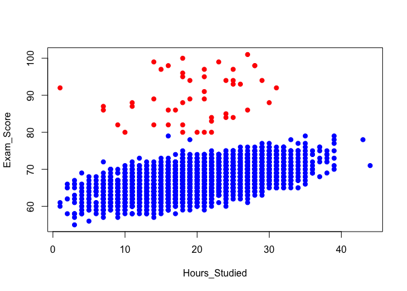
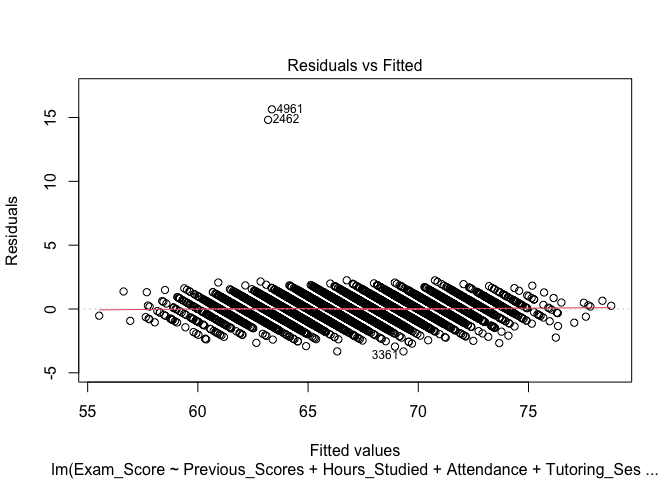
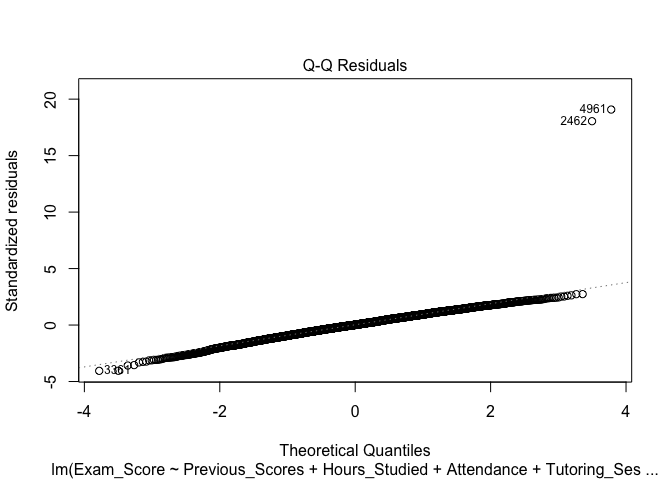

STAT_308_Project_Code
================
Justin Peabody
2026-04-12

This is a file containing the R code I used to run the regression
analyses and generate relevant visualizations for my STAT 308 final
project.

``` r
#To begin, I called the relevant packages and loaded the Kaggle data. 

library(tidyverse)
```

    ## Warning: package 'ggplot2' was built under R version 4.4.3

    ## Warning: package 'tibble' was built under R version 4.4.3

    ## Warning: package 'tidyr' was built under R version 4.4.3

    ## Warning: package 'readr' was built under R version 4.4.3

    ## Warning: package 'purrr' was built under R version 4.4.3

    ## Warning: package 'dplyr' was built under R version 4.4.3

    ## ── Attaching core tidyverse packages ──────────────────────── tidyverse 2.0.0 ──
    ## ✔ dplyr     1.2.0     ✔ readr     2.1.6
    ## ✔ forcats   1.0.1     ✔ stringr   1.6.0
    ## ✔ ggplot2   4.0.2     ✔ tibble    3.3.1
    ## ✔ lubridate 1.9.4     ✔ tidyr     1.3.2
    ## ✔ purrr     1.2.1     
    ## ── Conflicts ────────────────────────────────────────── tidyverse_conflicts() ──
    ## ✖ dplyr::filter() masks stats::filter()
    ## ✖ dplyr::lag()    masks stats::lag()
    ## ℹ Use the conflicted package (<http://conflicted.r-lib.org/>) to force all conflicts to become errors

``` r
library(regclass)
```

    ## Loading required package: bestglm
    ## Loading required package: leaps
    ## Loading required package: VGAM

    ## Warning: package 'VGAM' was built under R version 4.4.3

    ## Loading required package: stats4
    ## Loading required package: splines
    ## Loading required package: rpart
    ## Loading required package: randomForest
    ## randomForest 4.7-1.2
    ## Type rfNews() to see new features/changes/bug fixes.
    ## 
    ## Attaching package: 'randomForest'
    ## 
    ## The following object is masked from 'package:dplyr':
    ## 
    ##     combine
    ## 
    ## The following object is masked from 'package:ggplot2':
    ## 
    ##     margin
    ## 
    ## Important regclass change from 1.3:
    ## All functions that had a . in the name now have an _
    ## all.correlations -> all_correlations, cor.demo -> cor_demo, etc.

``` r
Education_data<-read_csv("~/Desktop/STAT 308/Data/StudentPerformanceFactors.csv")
```

    ## Rows: 6607 Columns: 20
    ## ── Column specification ────────────────────────────────────────────────────────
    ## Delimiter: ","
    ## chr (13): Parental_Involvement, Access_to_Resources, Extracurricular_Activit...
    ## dbl  (7): Hours_Studied, Attendance, Sleep_Hours, Previous_Scores, Tutoring_...
    ## 
    ## ℹ Use `spec()` to retrieve the full column specification for this data.
    ## ℹ Specify the column types or set `show_col_types = FALSE` to quiet this message.

``` r
#I then generated scatterplots of exam scores (the response variable) against each of the 10 predictor variables my group was interested in. Here is one example:

plot(Exam_Score~Hours_Studied, data=Education_data, col=ifelse(Education_data$Exam_Score>=80, "red", "blue"), pch=19)
```

<!-- -->

Creating these plots made it visually clear that the vast majority of
the dataset represents exam scores below 80. Only a small cluster of
observations correspond to exam scores at or above 80. This motivated
our group to split the data into two datasets based on exam score, then
generate a separate multiple regression model for each dataset.

``` r
High_exam_scores<-Education_data%>%
filter(Exam_Score >= 80)

Lower_exam_scores<-Education_data%>%
filter(Exam_Score<=79)
```

Now that our dataset is split into two subsets, we begin model building,
starting with the lower exam scores dataset.

``` r
#Filtering NA values from lower exam scores data

Lower_exam_scores<-Lower_exam_scores%>%
filter(Parental_Education_Level != "NA")%>%
filter(Distance_from_Home != "NA")

#Generating an initial model with all 10 predictors of interest for lower exam scores

Lower_exam_scores_initial_model<-lm(Exam_Score~Previous_Scores+Hours_Studied+Attendance+Tutoring_Sessions+Access_to_Resources+Parental_Involvement+Peer_Influence+Parental_Education_Level+Family_Income+Distance_from_Home, data=Lower_exam_scores)
summary(Lower_exam_scores_initial_model)
```

    ## 
    ## Call:
    ## lm(formula = Exam_Score ~ Previous_Scores + Hours_Studied + Attendance + 
    ##     Tutoring_Sessions + Access_to_Resources + Parental_Involvement + 
    ##     Peer_Influence + Parental_Education_Level + Family_Income + 
    ##     Distance_from_Home, data = Lower_exam_scores)
    ## 
    ## Residuals:
    ##     Min      1Q  Median      3Q     Max 
    ## -3.3281 -0.4959  0.0131  0.5363 15.6420 
    ## 
    ## Coefficients:
    ##                                        Estimate Std. Error t value Pr(>|t|)    
    ## (Intercept)                          41.9205001  0.1090806  384.31   <2e-16 ***
    ## Previous_Scores                       0.0492300  0.0007157   68.79   <2e-16 ***
    ## Hours_Studied                         0.2979648  0.0017166  173.58   <2e-16 ***
    ## Attendance                            0.1990955  0.0008902  223.65   <2e-16 ***
    ## Tutoring_Sessions                     0.4977756  0.0083279   59.77   <2e-16 ***
    ## Access_to_ResourcesLow               -1.9794069  0.0297494  -66.54   <2e-16 ***
    ## Access_to_ResourcesMedium            -0.9546914  0.0237606  -40.18   <2e-16 ***
    ## Parental_InvolvementLow              -1.9640718  0.0298633  -65.77   <2e-16 ***
    ## Parental_InvolvementMedium           -0.9679577  0.0239547  -40.41   <2e-16 ***
    ## Peer_InfluenceNeutral                 0.4694634  0.0278666   16.85   <2e-16 ***
    ## Peer_InfluencePositive                0.9841139  0.0277512   35.46   <2e-16 ***
    ## Parental_Education_LevelHigh School  -0.4900057  0.0236837  -20.69   <2e-16 ***
    ## Parental_Education_LevelPostgraduate  0.4953776  0.0295513   16.76   <2e-16 ***
    ## Family_IncomeLow                     -0.9518815  0.0284646  -33.44   <2e-16 ***
    ## Family_IncomeMedium                  -0.4113542  0.0284883  -14.44   <2e-16 ***
    ## Distance_from_HomeModerate            0.4821762  0.0373571   12.91   <2e-16 ***
    ## Distance_from_HomeNear                0.9585739  0.0350366   27.36   <2e-16 ***
    ## ---
    ## Signif. codes:  0 '***' 0.001 '**' 0.01 '*' 0.05 '.' 0.1 ' ' 1
    ## 
    ## Residual standard error: 0.8215 on 6385 degrees of freedom
    ## Multiple R-squared:  0.9402, Adjusted R-squared:  0.9401 
    ## F-statistic:  6275 on 16 and 6385 DF,  p-value: < 2.2e-16

This initial model explains 94.02% of the total variation in exam scores
less than 80, based on the multiple r squared. However, we must check
model assumptions via a residual plot and qqplot to assess its
appropriateness.

``` r
plot(Lower_exam_scores_initial_model, 1)
```

<!-- -->

``` r
plot(Lower_exam_scores_initial_model, 2)
```

<!-- -->
Overall, the assumptions of homoskedasticity and residual normality
appear to be satisfied for this model. However, two observations (the
2462nd and 4961st rows of the lower scores data) visually stand out as
possible influential observations.

To statistically test this, we computed the Jackknife residuals and
corresponding p values for these observations and compared the p values
to a significance level of 0.01.

``` r
#H0: observation is not statistically influential
#HA: observation is statistically influential

Lower_scores_Jackknife_residuals<-rstudent((Lower_exam_scores_initial_model))
jk_res_2462<-Lower_scores_Jackknife_residuals[2462]
jk_res_4961<-Lower_scores_Jackknife_residuals[4961]

#p values for each Jackknife residual

n=nrow(Lower_exam_scores)
k=17 #The total number of parameters in our initial model, including all predictors and the intercept

p_value_2462=2*pt(abs(jk_res_2462),df=n-k-1, lower.tail=FALSE)
p_value_2462
```

    ##         2462 
    ## 1.114129e-74

``` r
p_value_4961=2*pt(abs(jk_res_4961),df=n-k-1, lower.tail=FALSE)
p_value_4961
```

    ##         4961 
    ## 1.796819e-83

Both p values are less than 0.01, so for both observations, we reject H0
and conclude that they are statistically influential.
